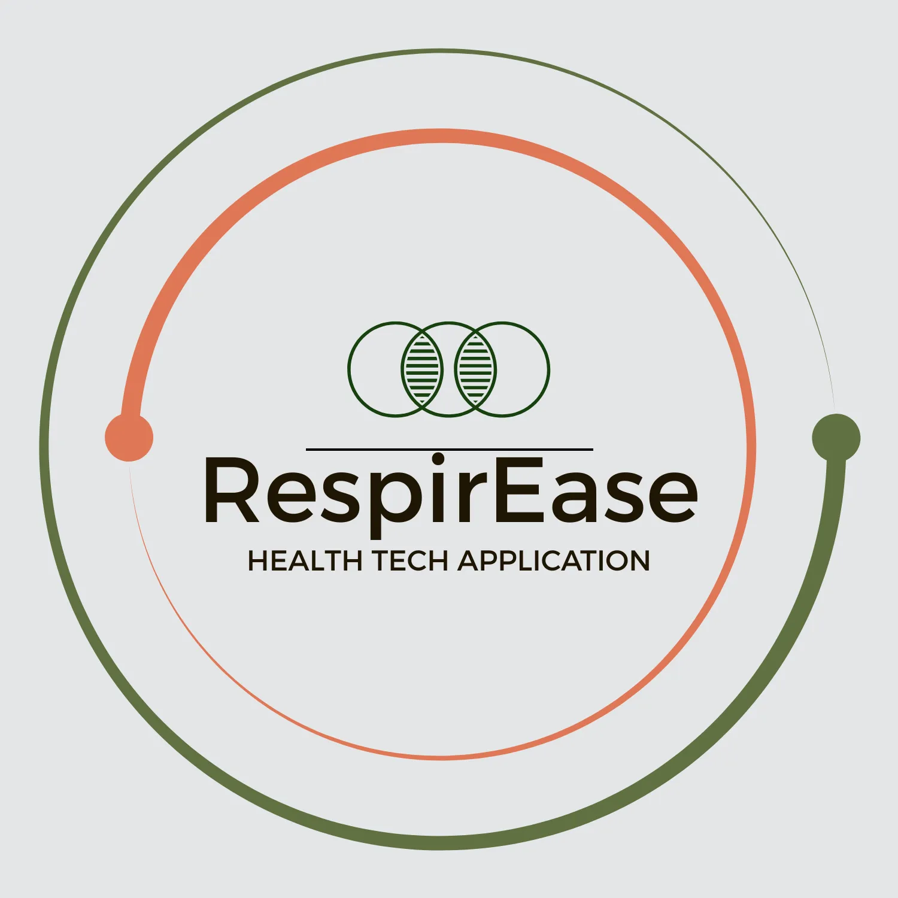

# RespirEase - Respiratory Health Management App



## 📱 Project Overview

RespirEase is a comprehensive Android application designed to help individuals manage respiratory health conditions such as COPD, asthma, and general respiratory wellness. The app provides tools for symptom tracking, breathing exercises, medication reminders, and educational content to support users in their respiratory health journey.

## ⚠️ Current Status & Honest Assessment

### ✅ What's Working
- **Complete UI Implementation**: All screens are fully designed with modern Material 3 UI
- **Database Architecture**: Room database with proper entities, DAOs, and repositories
- **Navigation**: Full navigation flow between all screens
- **MVVM Architecture**: Clean separation of concerns with ViewModels and UI states
- **Compose Integration**: Built with Jetpack Compose for modern Android development

### ⚠️ Known Issues & Limitations
- **Build Compatibility**: Currently experiencing dependency resolution issues with AGP 8.13.0
- **Testing**: Limited unit and integration tests
- **Backend Integration**: No real backend API integration (uses local data only)
- **Authentication**: No user authentication system implemented
- **Data Sync**: No cloud synchronization capabilities
- **Performance**: Not optimized for large datasets

### 🚧 Development Challenges Faced
- **Gradle/AGP Compatibility**: Struggled with Android Gradle Plugin 8.13.0 compatibility
- **Compose Dependencies**: Had to resolve multiple Compose BOM and Material3 version conflicts
- **Component Availability**: Replaced `HorizontalDivider` with `Divider` due to version compatibility

## 🏗️ Architecture

### Tech Stack
- **Language**: Kotlin
- **UI Framework**: Jetpack Compose
- **Architecture**: MVVM (Model-View-ViewModel)
- **Database**: Room (SQLite)
- **Dependency Injection**: Manual (no Hilt/Dagger)
- **Navigation**: Navigation Compose
- **Notifications**: Android Alarm Manager
- **Image Loading**: Coil

### Project Structure
```
app/src/main/java/com/example/respiratoryhealthapp/
├── data/
│   ├── dao/                    # Data Access Objects
│   ├── database/               # Room database setup
│   ├── model/                  # Data models/entities
│   └── repository/             # Repository pattern implementation
├── navigation/                 # Navigation setup
├── notifications/              # Notification and alarm management
├── screens/                    # UI screens
│   ├── breathingexercises/     # Breathing exercises feature
│   ├── dashboard/              # Main dashboard
│   ├── doctorsnotes/           # Doctor notes management
│   ├── educationalcontent/     # Educational articles
│   ├── profile/                # User profile management
│   ├── reminders/              # Medication/appointment reminders
│   ├── settings/               # App settings
│   ├── symptomdiary/           # Symptom tracking
│   └── testresults/            # Test results management
└── ui/                         # UI components and themes
```

## 🎯 Features

### Core Features
1. **Symptom Diary**: Track daily respiratory symptoms with severity levels
2. **Breathing Exercises**: Guided breathing exercises for different conditions
3. **Medication Reminders**: Set up reminders for medications and appointments
4. **Educational Content**: Access to respiratory health information
5. **Profile Management**: Personal information and health condition tracking
6. **Dashboard**: Overview of health data and quick actions

### Technical Features
- **Dark/Light Theme**: Material 3 theming with user preference
- **Local Data Storage**: Room database for offline functionality
- **Notification System**: Background reminders and alerts
- **Responsive UI**: Adaptive layouts for different screen sizes
- **Data Validation**: Input validation and error handling

## 🚀 Getting Started

### Prerequisites
- Android Studio Hedgehog (2023.1.1) or later
- Android SDK 26+ (Android 8.0+)
- Kotlin 2.0.21
- Gradle 8.9

### Installation
1. Clone the repository:
   ```bash
   git clone https://github.com/alexandernicolebravo/RespirEase.git
   ```

2. Open the project in Android Studio

3. Sync the project with Gradle files

4. Build and run the project

### Build Configuration
- **Target SDK**: 35 (Android 15)
- **Min SDK**: 26 (Android 8.0)
- **Compile SDK**: 35
- **AGP Version**: 8.7.3 (downgraded for compatibility)

## 📊 Database Schema

### Entities
- **UserProfile**: User personal information and preferences
- **Symptom**: Daily symptom tracking entries
- **BreathingExercise**: Exercise library with instructions
- **Reminder**: Medication and appointment reminders
- **DoctorNote**: Doctor visit notes and recommendations
- **TestResult**: Medical test results and lab values
- **EducationalArticle**: Health education content

## 🎨 UI/UX Design

### Design Principles
- **Material 3**: Following Google's latest design system
- **Accessibility**: High contrast ratios and readable typography
- **Consistency**: Unified design language across all screens
- **User-Friendly**: Intuitive navigation and clear information hierarchy

### Color Scheme
- Primary: Blue tones for trust and medical context
- Secondary: Green accents for positive health indicators
- Error: Red for alerts and warnings
- Surface: Adaptive colors for light/dark themes

## 🔧 Development Notes

### Dependencies Used
```kotlin
// Core Android
implementation("androidx.core:core-ktx:1.10.1")
implementation("androidx.lifecycle:lifecycle-runtime-ktx:2.7.0")

// Compose
implementation(platform("androidx.compose:compose-bom:2023.08.00"))
implementation("androidx.compose.ui:ui")
implementation("androidx.compose.material3:material3")

// Database
implementation("androidx.room:room-runtime:2.7.1")
implementation("androidx.room:room-ktx:2.7.1")

// Navigation
implementation("androidx.navigation:navigation-compose:2.7.7")

// Other
implementation("io.coil-kt:coil-compose:2.6.0")
implementation("androidx.datastore:datastore-preferences:1.1.6")
```

### Known Technical Debt
1. **Manual Dependency Injection**: Should implement Hilt for better DI
2. **Limited Error Handling**: Basic error states, needs improvement
3. **No Offline Sync**: Data is only stored locally
4. **Basic Testing**: Minimal test coverage
5. **Performance**: No pagination for large data sets

## 🐛 Troubleshooting

### Common Issues
1. **Build Failures**: Ensure you're using the correct Gradle and AGP versions
2. **Dependency Conflicts**: Clear Gradle cache if experiencing resolution issues
3. **Compose Preview Issues**: Make sure Compose compiler is properly configured

### Build Commands
```bash
# Clean and rebuild
./gradlew clean build

# Run tests
./gradlew test

# Generate APK
./gradlew assembleDebug
```

## 📈 Future Improvements

### Short Term
- [ ] Fix remaining build compatibility issues
- [ ] Add comprehensive unit tests
- [ ] Implement proper error handling
- [ ] Add data validation improvements

### Long Term
- [ ] Backend API integration
- [ ] User authentication system
- [ ] Cloud data synchronization
- [ ] Advanced analytics and insights
- [ ] Healthcare provider integration
- [ ] Wearable device integration

## 🤝 Contributing

This project is currently in active development. If you'd like to contribute:

1. Fork the repository
2. Create a feature branch
3. Make your changes
4. Test thoroughly
5. Submit a pull request

## 📄 License

This project is licensed under the MIT License - see the [LICENSE](LICENSE) file for details.

## 👥 Authors

- **Alexander Nicole Bravo** - *Initial work* - [alexandernicolebravo](https://github.com/alexandernicolebravo)

## 🙏 Acknowledgments

- Material 3 Design System
- Android Jetpack Compose team
- Room database library
- Open source community

## 📞 Support

For support, email alexandernicolebravo@gmail.com or create an issue in this repository.

---

**Note**: This project is a work in progress and may contain bugs or incomplete features. Use at your own discretion for production purposes.
